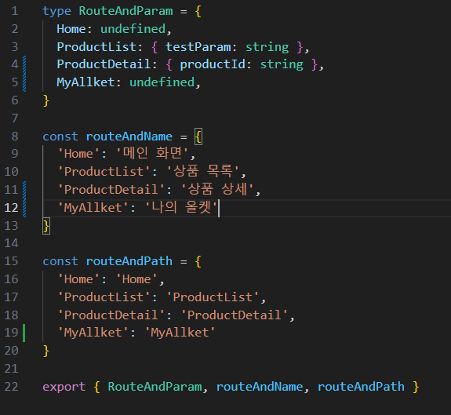

# 실행 방법

**패키지 매니저로 `Yarn` 사용 O, `Npm`은 사용 X**

# 최초 실행 시 실행 명령어

`yarn start`

# Git Commit 규칙

[Git Tips and Git Commit Best Practices · GitHub](https://gist.github.com/luismts/495d982e8c5b1a0ced4a57cf3d93cf60)

1. **Commit을 할 땐 Commit 내용과 관련된 내용만 하기** 서로 다른 2개의 에러를 고쳤다면 Commit은 2개가 되어야 함
2. **Commit은 최대한 자주** Commit을 자주 할수록 Commit 내용이 줄어들어 다른 사람이 Commit을 이해하기 좋음. Commit 내용이 적으면 merge conflict가 발생할 위험도 감소함.
3. **미완성 코드는 Commit 하지 않기**
4. **Branch 최대한 자주 사용** 에러 수정, 새로운 기능 추가, 리팩토링 등등 모든 작업을 시작할 땐 항상 새로 브랜치를 만든 후 거기에서 작업하기. 작업 완료하면 main 브랜치에 merge 후 작업했던 브랜치는 삭제
5. **Commit 내용에는 왜, 무엇을, 어떻게 고쳤는지가 포함되어 있어야 함**

## Commit 작성 시 규칙

[Git Commit Guidelines | EU System (europa.eu)](https://ec.europa.eu/component-library/v1.15.0/eu/docs/conventions/git/)

- Commit 메시지는 현재형으로 작성

  - change ( O )
  - changed ( X )

- 1줄 요약 Commit 메시지는 50자 이내로 작성

- **1줄 요약 Commit 메시지 앞에 Commit의 타입을 표시**

  | 타입     | 의미                                                              |
  | -------- | ----------------------------------------------------------------- |
  | feature  | 새로운 기능 추가                                                  |
  | fix      | 에러 수정                                                         |
  | docs     | 주석이나 README 수정                                              |
  | style    | 코드에 영향을 주지 않는 변경 ( css, 포맷 변경, 세미콜론 추가 등 ) |
  | refactor | 리팩토링                                                          |
  | test     | 테스트 코드 작성                                                  |
  | chore    | 라이브러리 추가, 빌드 스크립트 수정 등                            |

- 메시지는 항상 명령형 방식으로 명확하게 작성

  - clean unused code ( O )
  - cleaning unused code ( X )
  - cleaned unused code ( X )
  - unused code deleted ( X )

## Commit 예시

1. **Commit 내용이 적은 경우** 1줄 요약만 작성

   ```tex
   (refactor) Update main carousel
   ```

2. **Commit 내용이 많아 설명이 필요한 경우** 1줄 요약과 한 줄 띄고 상세 내용 기재

   ```tex
   (refactor) Update main carousel

   - optimize carousel animation
   -- something something

   - add props to carousel component for reusability
   -- something
   --- something something
   ```

   한 줄 띄는 이유는 CLI로 commit log를 볼 때 1줄 요약만 보기 위해서임

# 주요 라이브러리

- **UI**

  - `React Native Element` ( [Overview | React Native Elements](https://reactnativeelements.com/docs) )
  - 사용 가능 아이콘 목록 [react-native-vector-icons directory (oblador.github.io)](https://oblador.github.io/react-native-vector-icons/)

- **Navigation**
  - `React Navigation` ( [Getting started | React Navigation](https://reactnavigation.org/docs/getting-started/) )
- **Safe Area Context**

  - [SafeAreaContext - Expo Documentation](https://docs.expo.dev/versions/latest/sdk/safe-area-context/)
  - 기기마다 다른 노치, 상태바, 기본 UI 등의 크기를 고려해서 화면의 크기를 자동으로 조정해주는 라이브러리

- **push-notifications**
  - [Push notifications setup](https://docs.expo.dev/push-notifications/push-notifications-setup/)
  - 푸시 알림 설정 방법 설명
  - 서버 자격 증명 key: AAAA_tErRoU:APA91bHXjuvObzSHD3wNK9GzwPBMH-6XhJsQMgntfjr-F-uVcMucypl09pFq6O4YoUepsjyz22qCsFf8MBH1nXt1mArLBPtxm2qZsKL1HxdcjfNxz1wCUWf5oFs4oTe1PxaMsG4PMi0s

# 화면 추가하는 방법

1. config > navigation.ts 파일에 추가하려는 경로의 정보를 입력
2. App.tsx 파일의 코드를 참고해서 `<Screen /> ` 컴포넌트를 이용해서 라우팅 선언

<div style="text-align:center">
  
</div>
